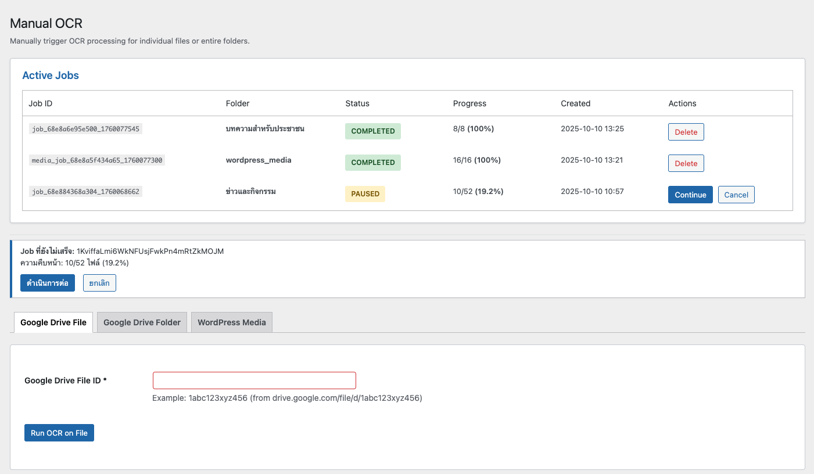

# jSearch – ระบบค้นหาสำหรับ WordPress และ PDF Content

[](https://www.gnu.org/licenses/gpl-2.0.html)
[](https://wordpress.org/)
[](https://php.net/)

ปลั๊กอิน WordPress สำหรับค้นหาเนื้อหาแบบเต็มรูปแบบในบทความ หน้าเพจ และไฟล์ PDF พร้อมรองรับ OCR

> **ต้องมี OCR API**
> OCR API Repository → [TBA]

---

## Screenshots

<details>
<summary>Manual OCR - จัดการงาน OCR และประมวลผลไฟล์</summary>



หน้าจัดการ OCR แบบ Manual:
- ตารางแสดง Active Jobs (งานที่กำลังทำ)
- สถานะงาน: COMPLETED, PAUSED พร้อม progress (%)
- ปุ่ม Continue/Cancel สำหรับควบคุมงาน
- 3 โหมด OCR: Google Drive File, Google Drive Folder, WordPress Media
- แสดง Job ID และเวลาที่สร้างงาน

</details>

---

## ความสามารถหลัก

### การค้นหา
- ค้นหาแบบเต็มรูปแบบในเนื้อหา PDF, บทความ และหน้าเพจ
- 2 โหมดค้นหา: เฉพาะ PDF หรือค้นหาทั้งหมด (รวมบทความและหน้าเพจ)
- ไฮไลท์คำค้นหาในผลลัพธ์
- แคชผลการค้นหาเพื่อความเร็ว

### การประมวลผล OCR

**มี 3 โหมดให้เลือก:**

| โหมด | คำอธิบาย |
|------|----------|
| Google Drive File | ประมวลผลทีละไฟล์ |
| Google Drive Folder | ประมวลผลทั้งโฟลเดอร์พร้อมกัน |
| WordPress Media | ประมวลผล PDF จาก Media Library |

**คุณสมบัติของการประมวลผล OCR:**
- ตรวจจับไฟล์ซ้ำอัตโนมัติ (ข้ามไฟล์ที่ประมวลผลแล้ว)
- ประมวลผลเป็นชุด (5 ไฟล์ต่อชุด)
- ติดตามความคืบหน้าแบบเรียลไทม์
- หยุดและทำงานต่อได้ทุกเมื่อ

### OCR อัตโนมัติ
> เลือกเปิด / ปิด ได้ที่ Settings → Automation

ตรวจจับและประมวลผล PDF อัตโนมัติเมื่อบันทึกบทความจาก:
- URL ของ Google Drive
- การฝัง Google Drive (embeds/iframes)
- ไฟล์ PDF แนบ
- PDF ฝังในเนื้อหา

---

## ความต้องการของระบบ

| ระบบ | เวอร์ชันขั้นต่ำ |
|------|----------------|
| WordPress | 5.0+ |
| PHP | 7.4+ |
| MySQL | 5.6+ |
| Python OCR API Service | สำหรับ PDF ที่เป็นภาพสแกน |

---

## การติดตั้ง

```bash
# 1. อัปโหลดโฟลเดอร์ jsearch ไปที่
/wp-content/plugins/

# 2. เปิดใช้งานปลั๊กอินใน WordPress

# 3. ตั้งค่า API ที่
jSearch → Settings → API
```

---

## วิธีใช้งาน

### Shortcode

แบบพื้นฐาน:
```php
[jsearch]
```

พร้อมพารามิเตอร์:
```php
[jsearch limit="20" show_popular="yes" show_thumbnail="yes"]
```

### REST API

<details>
<summary>ตัวอย่าง API Endpoints</summary>

**ค้นหา:**
```http
GET /wp-json/jsearch/v1/query?q=คำค้นหา&limit=10&offset=0
```

**สถิติ:**
```http
GET /wp-json/jsearch/v1/stats
```

ดูเอกสาร REST API เพิ่มเติมได้ที่ Settings → Usage

</details>

---

## ตารางฐานข้อมูล

<details>
<summary>โครงสร้างฐานข้อมูล</summary>

### `wp_jsearch_pdf_index`
เก็บเนื้อหา PDF และข้อมูลเมตา

| คอลัมน์ | คำอธิบาย |
|---------|----------|
| `file_id` (UNIQUE) | Google Drive ID หรือ `media_{attachment_id}` |
| `content` | เนื้อหาจาก OCR (มี full-text index) |
| `post_id` | เชื่อมโยงกับบทความ WordPress |
| `folder_id` | หมวดหมู่ |

### `wp_jsearch_jobs`
จัดการงาน OCR

| สถานะ | คำอธิบาย |
|-------|----------|
| `processing` | กำลังทำงาน |
| `paused` | หยุดชั่วคราว |
| `completed` | เสร็จสิ้น (ลบอัตโนมัติหลัง 1 ชั่วโมง) |

### `wp_jsearch_job_batches`
แบ่งงานเป็นชุด (5 ไฟล์ต่อชุด)

### `wp_jsearch_folders`
จัดการหมวดหมู่โฟลเดอร์ Google Drive

</details>

---

## กระบวนการทำงาน (Job)

```
ผู้ใช้เริ่มงาน OCR
    ↓
สร้างงานและแบ่งเป็นชุด (5 ไฟล์ต่อชุด)
    ↓
ประมวลผลทีละชุด (JavaScript)
    ↓
สำหรับแต่ละไฟล์:
    - ตรวจสอบว่าประมวลผลแล้วหรือไม่
    - ถ้ายัง → OCR ผ่าน API → บันทึกลงฐานข้อมูล
    - ถ้าแล้ว → ข้าม
    ↓
อัปเดตความคืบหน้าแบบเรียลไทม์
    ↓
งานเสร็จสิ้น → ลบอัตโนมัติหลัง 1 ชั่วโมง
```

---

## การแก้ปัญหาเบื้องต้น

<details>
<summary>REST API ขึ้น 404</summary>

1. ไปที่ Settings → Permalinks แล้วคลิก "Save Changes"
2. ตรวจสอบที่ jSearch → REST API Debug

</details>

<details>
<summary>OCR ไม่ทำงาน</summary>

1. ตรวจสอบการตั้งค่า API ที่ jSearch → Settings → API
2. ทดสอบการเชื่อมต่อ
3. เปิด Debug Mode และตรวจสอบ log ที่ `/wp-content/uploads/jsearch/jsearch.log`

</details>

<details>
<summary>ค้นหาแล้วไม่มีผลลัพธ์</summary>

1. ตรวจสอบข้อมูลที่ Dashboard
2. ตรวจสอบหน้าที่ไม่รวมในการค้นหาที่ Settings
3. เปิด "Include All Posts/Pages" ถ้าต้องการ
4. ล้างแคชการค้นหา

</details>

<details>
<summary>งานหยุดชั่วคราว</summary>

1. กลับไปที่ jSearch → Manual OCR
2. ดูตาราง Active Jobs
3. คลิก "Continue" เพื่อทำงานต่อจากจุดเดิม

</details>

---

## FAQ

<details>
<summary>ต้องมี OCR service หรือไม่?</summary>

ไม่จำเป็น แต่ต้องมีสำหรับ PDF ที่เป็นภาพสแกน

</details>

<details>
<summary>การประมวลผลเป็นชุดจะทำ OCR ไฟล์ซ้ำไหม?</summary>

ไม่ ระบบตรวจสอบฐานข้อมูลก่อนประมวลผลแต่ละไฟล์และข้ามไฟล์ที่ทำแล้วอัตโนมัติ

</details>

<details>
<summary>ถ้าออกจากหน้าตอนกำลัง OCR จะเป็นยังไง?</summary>

งานจะหยุดอัตโนมัติ กลับมาแล้วคลิก "Continue" เพื่อทำงานต่อจากจุดเดิม

</details>

<details>
<summary>หยุดและทำงานต่อได้ไหม?</summary>

ได้ทุกโหมด เมื่อหยุด ระบบจะรอให้ชุดปัจจุบัน (5 ไฟล์) เสร็จก่อน

</details>

<details>
<summary>งานที่เสร็จแล้วจะหายไปไหม?</summary>

งานที่มีสถานะ `completed` จะถูกลบอัตโนมัติหลัง 1 ชั่วโมง แต่ข้อมูล PDF ที่ทำ OCR แล้วยังคงอยู่ในฐานข้อมูลและไม่ได้รับผลกระทบ

</details>

---

## โครงสร้างไฟล์

```
jsearch/
├── admin/              # ส่วนจัดการ
├── assets/             # CSS และ JavaScript
├── includes/           # คลาสหลัก
├── public/             # ส่วนแสดงผลหน้าเว็บ
└── jsearch.php         # ไฟล์หลักของปลั๊กอิน
```

---

## Contributing

ยินดีรับ Pull Requests! นะครับ

```bash
# Fork และสร้าง feature branch
git checkout -b feature/awesome-feature

# Commit การเปลี่ยนแปลง
git commit -m 'Add awesome feature'

# Push ไปยัง branch
git push origin feature/awesome-feature

# เปิด Pull Request
```

---

## ประวัติการเปลี่ยนแปลง

**Version 1.0.0**

- รองรับ WordPress Media OCR
- 3 โหมด OCR (Google Drive File, Google Drive Folder, WordPress Media)
- OCR อัตโนมัติจาก 4 แหล่ง
- อัปโหลดไฟล์ไปยัง OCR API โดยตรง
- ค้นหาแบบ global (รวมบทความและหน้าเพจทั้งหมด)
- ระบบบันทึกที่ปรับปรุงแล้ว
- ค้นหาแบบเต็มรูปแบบใน PDF และเนื้อหา WordPress
- ประมวลผลเป็นชุดพร้อมหยุด/ทำงานต่อ
- REST API
- Dashboard สำหรับผู้ดูแลระบบ

---

## License

GPL v2 or later

---

**Developed by จิรัถ บุรพรัตน์**
[jirathsoft.com](https://jirathsoft.com) | [dev.jirath.com](https://dev.jirath.com)
